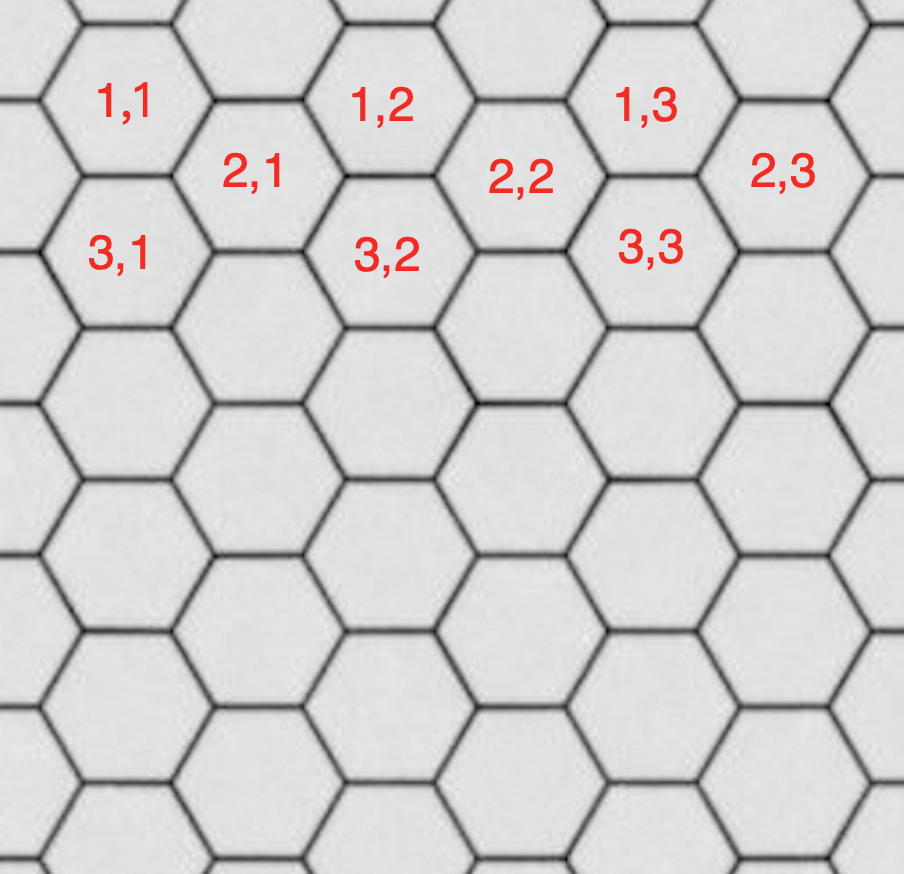

# 点亮灯泡（All Light）- 需求文档

## 1. 产品概述

**点亮灯泡** 是一款 HTML5 益智游戏。玩家通过旋转网格中的电线方块，将所有灯泡连接到电源（电池），使所有灯泡点亮即可通关。

- **产品形态**：纯前端多页应用（统一入口 + iframe 加载游戏页面，无后端）
- **运行环境**：现代浏览器（桌面 + 移动端）
- **部署方式**：静态文件托管

## 2. 目标用户

- 喜欢逻辑推理和空间思维解谜游戏的玩家
- 碎片化时间消遣的移动端用户
- 追求最佳成绩（最短用时）的挑战型玩家

## 3. 核心玩法

### 3.1 游戏流程

1. 玩家在难度选择界面选择一个难度等级
2. 系统生成一个铺满网格的电路拼图，其中部分方块被随机旋转
3. 玩家点击/触摸方块，每次将其顺时针旋转 90°
4. 当电池到灯泡的电路连通时，对应电线和灯泡点亮（变为金色）
5. 所有灯泡点亮后通关，显示用时和新纪录提示

### 3.2 通关条件

所有灯泡均通过连通的电线连接到电池正极。

### 3.3 电路拓扑规则

1. **树形结构**：整个电路必须是以电池为根的树形结构（生成树），不允许出现环路（网状连接）。
2. **末端规则**：树的每个叶子节点必须是灯泡或电池，不允许存在没有末端元素的悬空电线。换言之，电线方块（2个及以上开口）只能出现在树的内部节点，叶子节点必须是灯泡。
3. **可解性保证**：关卡采用 DFS 生成树算法：从电池出发，生成一棵覆盖所有网格单元的树，确保每条电路都有解，不存在不可解的关卡。

## 4. 功能需求

### 4.1 难度系统

| 难度 | 网格类型 | 网格尺寸 | 说明 |
|------|----------|----------|------|
| 入门 | 正方形 | 3 × 5    | |
| 简单 | 正方形 | 5 × 8    | |
| 困难 | 正方形 | 9 × 14   | |
| 地狱1 | 六边形 | 1/2 × 7  | 偶数行1列/奇数行2列 |
| 地狱2 | 六边形 | 3/4 × 17 | 偶数行3列/奇数行4列 |
| 地狱3 | 六边形 | 5/6 × 25 | 偶数行5列/奇数行6列 |

灯泡数量由 DFS 生成树的叶子节点数量决定（叶子节点 = 仅有1个连接的单元格）。

### 4.2 地狱难度（六边形网格）

#### 网格特性
- **六边形类型**：平顶六边形（flat-top hexagon）
- **坐标系统**：交错行布局（偶数行列数较少并向右偏移1.5r，奇数行列数较多无偏移）
- **网格尺寸**：参见难度表，列数交替（偶数行/奇数行）× 行数
- **方向数**：6 个方向，每次旋转 60°

**行列定义**：
- **行**：处于同一水平高度的六边形定义为同一行
- **列**：同一行内的六边形按从左到右顺序编号，同行内相邻六边形不相邻（中间隔有其他行的六边形）
- 示例：坐标 (1,1), (1,2), (1,3) 属于同一行（行 1），它们之间水平间隔 3r

#### 几何参数（边长 = r）
- 六边形宽度：`2 * r`（左右顶点距离）
- 六边形高度：`√3 * r`（上下平行边距离）
- 列间距：`3 * r`（同一行内相邻六边形中心的水平距离）
- 行间距：`√3/2 * r`（相邻行中心的垂直距离）
- 奇数行 X 偏移：`1.5 * r`（奇数行相对偶数行向右偏移列间距的一半）

**推导验证**：相邻六边形（跨行）的中心距离 = √(1.5r)² + (√3/2 * r)² = √(2.25 + 0.75)r² = √3 * r，与平顶六边形紧邻中心距一致。

#### 电线方向（垂直于边）
6 个方向对应角度（平顶六边形）：
- DIR_E: 0°
- DIR_SE: 60°
- DIR_SW: 120°
- DIR_W: 180°
- DIR_NW: 240°
- DIR_NE: 300°

#### 方块类型（六边形专用）

| 类型 | 开口数 | 说明 |
|------|--------|------|
| 直线 (LINE) | 2（对向，180°） | 两个相对方向连通 |
| 弯道 (CURVE) | 2（相邻，60°） | 两个相邻方向连通 |
| 钝角 (ANGLE) | 2（跳一，120°） | 两个间隔一个方向连通 |
| T型 (TEE) | 3（连续） | 三个连续方向连通 [0,1,2] |
| 扇型 (FAN) | 3（非连续） | 间隔分布 [0,1,3]，gap升序 |
| 扇型2 (FAN2) | 3（非连续） | 间隔分布 [0,1,4]，gap降序 |
| Y型 (Y) | 3（均匀） | 三个均匀分布方向 [0,2,4] |
| 拐角 (CORNER) | 4（连续） | 四个连续方向连通 [0,1,2,3] |
| 交叉4 (CROSS4) | 4（非连续） | 四个方向 [0,1,2,4]，gap [1,1,2,2] |
| 对称4 (PAIRS4) | 4（交替） | 四个方向 [0,1,3,4]，gap [1,2,1,2] |
| 五连 (FILL5) | 5 | 五个方向连通 |
| 六连 (FILL6) | 6 | 全方向连通，不可旋转 |
| 灯泡 (BULB) | 1（输入） | 接收电流，点亮即通关条件（树的叶子节点） |
| 电池 (BATTERY) | 1（输出） | 电源起点，不可旋转（树的根节点） |

#### 代码结构
- 独立目录：`src/hex/`
- 文件分离：`index.html`、`game.js`、`styles.css`
- 核心算法复用正方形版本的 DFS 生成树和 BFS 连通性检测
- 游戏页面通过 iframe 加载，返回菜单通过 `postMessage` 与父页面通信

#### 特殊规则
- FILL6（六连）方块不可旋转，始终全连通
- BATTERY（电池）不可旋转
- 其他方块每次点击顺时针旋转 60°（1 个方向）

### 4.3 方块类型（正方形网格）

| 类型 | 开口数 | 说明 |
|------|--------|------|
| 直线 (STRAIGHT) | 2（对向） | 上下或左右连通 |
| 弯道 (CURVE) | 2（相邻） | 如上右、右下等 |
| T型 (TEE) | 3 | 三个方向连通 |
| 十字 (CROSS) | 4 | 四向连通，不可旋转 |
| 灯泡 (BULB) | 1（输入） | 接收电流，点亮即通关条件 |
| 电池 (BATTERY) | 1（输出） | 电源起点，不可旋转 |

### 4.4 游戏控制

| 按钮 | 功能 |
|------|------|
| ⏸ 暂停 | 暂停/继续游戏，暂停时停止计时 |
| 💡 提示 | 逐个将方块还原为正确旋转方向，每次间隔 120ms |
| ↺ 重置 | 重新生成当前难度的新谜题，计时归零 |
| 🔊 音效 | 开启/关闭音效 |
| ✕ 返回 | 返回难度选择菜单 |

### 4.5 计时与记录

- 顶部栏左侧并列显示：⏱ 本局用时 + 🏆 最佳纪录
- 顶部栏中央显示：灯泡亮灯数指示器
- 实时显示游戏用时（MM:SS 格式）
- 使用 LocalStorage 持久化保存每个难度的最佳记录
- 通关时如打破最佳记录，显示"新纪录！"提示

### 4.6 音效系统

使用 Web Audio API 播放音效：
- **rotate**：旋转方块（sine 600→800Hz）
- **light**：灯泡点亮（sine 880→1200Hz）
- **win**：通关（523/659/784/1047Hz 四音阶）
- **click**：按钮点击（square 400Hz）

### 4.7 背景音乐（BGM）

- 使用 Web Audio API 合成的电子背景音乐（128 BPM，Cm 调）
- 公共模块：`src/common/bgm.js`，由根页面加载并持久运行
- **自动播放**：首次用户交互（点击难度按钮）时创建 AudioContext 并启动播放
- **持续播放**：采用 iframe 架构，根页面不会被销毁，BGM 在游戏切换间无缝持续
- **全局开关**：难度选择界面显示内联按钮，游戏中显示悬浮按钮（右上角，z-index 9999）
- **偏好持久化**：使用 `localStorage` 键 `bgm_on`（'1' / '0'）记忆用户选择

### 4.8 通关提示

- 通关后在页面顶部显示"恭喜通关！"横幅（不遮挡游戏网格）
- 页面底部显示"返回菜单"按钮
- 玩家可以在通关后继续观察完整的已解棋盘

## 5. 非功能需求

### 5.1 性能

- 多文件架构，按需加载游戏页面（iframe），无需网络请求外部资源
- Canvas 渲染，使用 devicePixelRatio 保证高清屏清晰度
- 旋转动画使用 CSS transform + GPU 加速（80ms ease-out，普通模式与地狱模式一致）
- 旋转动画进行中不响应新的点击操作

### 5.2 兼容性

- 支持触摸事件和鼠标点击
- 响应式布局，适配手机竖屏和桌面浏览器
- 禁用双击缩放和长按选中

### 5.3 视觉规范

#### 普通模式
- 深色主题（#1a1a2e 背景）
- 电线未点亮为灰蓝（#5a6a7a），点亮为金色（#f5c542）
- 电池：灰绿色身体，银灰色正极，闪电图案
- 灯泡：点亮时金色外壳 + W型灯丝 + 发光效果
- 灯泡绘制规则：螺口正对电线方向，W型灯丝底部朝向电线

#### 地狱模式
- 深紫红色背景（#1a0a1e），带网格纹理和脉动动画
- 电线未点亮为灰紫（#6a5a8a），点亮为紫色（#b388ff）
- 六边形填充色：未点亮时随机使用5种不同深度的灰紫色之一，点亮时为透明（与普通模式一致）
- 电池和电线宽度比普通模式增大50%
- 灯泡总体尺寸比普通模式增大50%
- 电池闪电图标增大50%
- 灯泡绘制规则：螺口正对电线方向，W型灯丝底部朝向电线

#### 地狱模式动画效果
- **电流光束动画**：从电池沿电路树传播的光束效果，每3~6秒触发一次
  - 光束沿已点亮的电路路径传播，到达分叉处随机选择一个或多个分支
  - 路径选择算法：先在所有已点亮灯泡中随机选择1~N个目标灯泡，再反向追溯到电池形成路径（确保所有灯泡被选中概率均等）
  - 光束具有发光拖尾效果（shadowBlur=14）和移动光头（半径4.5px）
- **灯泡闪烁**：电流光束到达灯泡末端时触发闪烁动画（0.5秒），带 drop-shadow 辉光效果
- **通关后动画继续**：完成游戏后电流光束和灯泡闪烁动画不暂停，持续播放

### 5.4 数据持久化

- LocalStorage 存储键：
  - 正方形网格：`circuit_best_{difficulty}`
  - 六边形网格：`hex_best_{difficulty}`
- 仅存储最佳用时秒数（整数）
